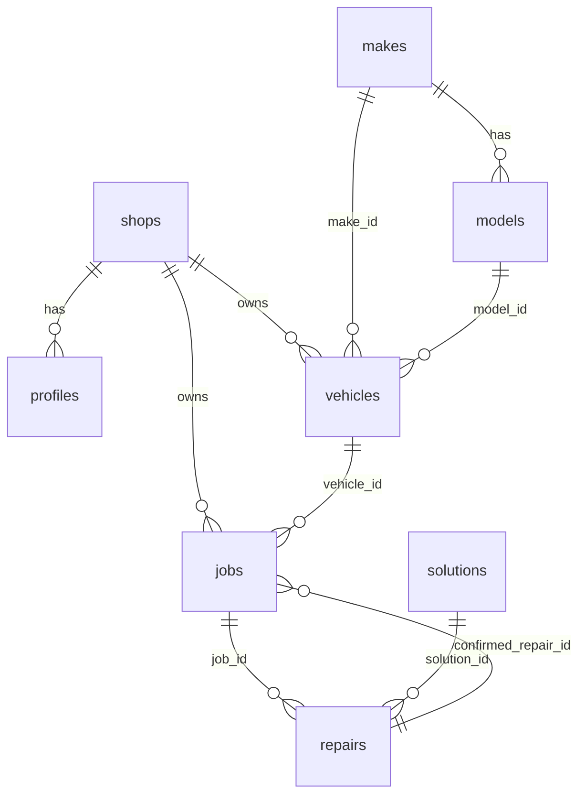

# Argos One — Supabase Backend Plan

Status: **proposal, nothing built yet.** As of 2026-08-08 the app uses hardcoded
seed data (`lib/vehicle-data.ts`), in-memory mock data (`lib/mock-data.ts`), and
per-device `localStorage` for custom makes/models. There is no Supabase project,
client, `.env`, or table.

This document is the design to review before we build.

---

## 1. Guiding decisions

- **Australia-first.** Multi-tenant from the start (each shop's jobs are private),
  but the **makes/models catalog is shared globally** — a model one shop adds
  helps everyone, which is the whole point of "recorded for future usage."
- **The knowledge base is outcome-driven.** We don't store a solution's success
  rate as a fixed number. We record each *repair outcome* (did this fix work?),
  and compute success-rate / occurrences / avg-time from those rows. That's what
  makes rankings improve as more repairs are logged.
- **Case-insensitive uniqueness** on make/model names, enforced in the database —
  so `sq5` and `SQ5` can never both exist (matches the current UI behaviour).

---

## 2. Schema



### Catalog (shared, global)

```sql
-- Case-insensitive-unique makes
create table makes (
  id         uuid primary key default gen_random_uuid(),
  name       text not null,
  is_custom  boolean not null default false,
  created_by uuid references auth.users(id),
  created_at timestamptz not null default now()
);
create unique index makes_name_lower_idx on makes (lower(name));

create table models (
  id         uuid primary key default gen_random_uuid(),
  make_id    uuid not null references makes(id) on delete cascade,
  name       text not null,
  is_custom  boolean not null default false,
  created_by uuid references auth.users(id),
  created_at timestamptz not null default now()
);
create unique index models_make_name_lower_idx on models (make_id, lower(name));
```

### Tenancy (shops + users)

```sql
create table shops (
  id         uuid primary key default gen_random_uuid(),
  name       text not null,
  created_at timestamptz not null default now()
);

-- One row per authenticated user, linking them to a shop
create table profiles (
  id         uuid primary key references auth.users(id) on delete cascade,
  shop_id    uuid references shops(id),
  full_name  text,
  role       text not null default 'mechanic',  -- mechanic | owner
  created_at timestamptz not null default now()
);
```

### Vehicles & jobs (per-shop)

```sql
create table vehicles (
  id         uuid primary key default gen_random_uuid(),
  shop_id    uuid not null references shops(id) on delete cascade,
  vin        text,
  year       int,
  make_id    uuid references makes(id),
  model_id   uuid references models(id),
  mileage    int,
  engine     text,
  trim       text,
  body_style text,
  created_at timestamptz not null default now()
);

create type job_status as enum ('open', 'resolved');

create table jobs (
  id                  uuid primary key default gen_random_uuid(),
  shop_id             uuid not null references shops(id) on delete cascade,
  vehicle_id          uuid not null references vehicles(id) on delete cascade,
  status              job_status not null default 'open',
  symptoms            text,
  customer_complaint  text,
  dtc_codes           text[] not null default '{}',
  confirmed_repair_id uuid,          -- set when a repair is confirmed as the fix
  created_at          timestamptz not null default now(),
  resolved_at         timestamptz
);
```

### Knowledge base (solutions + outcomes)

```sql
create type solution_category as enum
  ('electrical','mechanical','emissions','fuel','cooling','transmission','brakes','other');

-- A candidate fix for a symptom/code. Optionally scoped to a make/model.
create table solutions (
  id         uuid primary key default gen_random_uuid(),
  title      text not null,
  category   solution_category not null default 'other',
  dtc_code   text,                       -- the code this addresses (nullable)
  make_id    uuid references makes(id),  -- null = applies to any make
  model_id   uuid references models(id), -- null = applies to any model
  parts      text[] not null default '{}',
  notes      text,
  created_at timestamptz not null default now()
);

-- The learning loop: one row each time a solution is tried on a job.
create table repairs (
  id                uuid primary key default gen_random_uuid(),
  job_id            uuid not null references jobs(id) on delete cascade,
  solution_id       uuid not null references solutions(id),
  worked            boolean not null,
  repair_time_hours numeric(4,1),
  notes             text,
  created_by        uuid references auth.users(id),
  created_at        timestamptz not null default now()
);
```

### Ranking view (computed, not stored)

```sql
create view solution_stats as
select
  s.id as solution_id,
  count(r.*)                                   as occurrences,
  coalesce(avg((r.worked)::int) * 100, 0)      as success_rate,
  round(avg(r.repair_time_hours), 1)           as avg_repair_time_hours
from solutions s
left join repairs r on r.solution_id = s.id
group by s.id;
```

> To rank "what worked on *this* vehicle," query `repairs` joined to `jobs`/
> `vehicles` filtered by make/model/year — same aggregation, narrower slice.

---

## 3. Row-Level Security (RLS)

Enable RLS on every table. Two patterns:

**Shared catalog** (`makes`, `models`, `solutions`) — any signed-in user reads;
any signed-in user inserts (that's the crowd-sourced catalog):

```sql
alter table makes enable row level security;
create policy "read makes"   on makes for select to authenticated using (true);
create policy "insert makes" on makes for insert to authenticated with check (true);
-- same for models, solutions
```

**Per-shop data** (`vehicles`, `jobs`, `repairs`) — a user only sees their shop's
rows, via their `profiles.shop_id`:

```sql
alter table jobs enable row level security;
create policy "shop reads its jobs" on jobs for select to authenticated
  using (shop_id = (select shop_id from profiles where id = auth.uid()));
create policy "shop writes its jobs" on jobs for insert to authenticated
  with check (shop_id = (select shop_id from profiles where id = auth.uid()));
-- same pattern for vehicles, repairs (repairs via job -> shop)
```

---

## 4. App integration — what changes

| Today | After Supabase |
|---|---|
| `getAllMakes()` reads seed + localStorage | `select * from makes order by name` |
| `getModelsForMake(make)` | `select * from models where make_id = …` |
| `addCustomMake` / `addCustomModel` (localStorage) | `insert into makes/models` (shop-wide) |
| `normalizeMake()` | unnecessary — DB is the canonical source |
| `mockJobs` / `mockSolutions` (in-memory) | `jobs`, `solutions`, `repairs` tables |
| `getSolutionsForCodes()` | query `solutions` + `solution_stats`, filtered by code/vehicle |

Client setup:
- `npm i @supabase/supabase-js @supabase/ssr`
- `lib/supabase/client.ts` (browser) and `lib/supabase/server.ts` (server components / route handlers)
- Env vars in `.env.local` **and** Vercel project settings:
  - `NEXT_PUBLIC_SUPABASE_URL`
  - `NEXT_PUBLIC_SUPABASE_ANON_KEY`
  - `SUPABASE_SERVICE_ROLE_KEY` (server-only, for seed scripts / admin)

---

## 5. Suggested build order

1. **Phase 1 — Catalog.** Create `makes` + `models`, seed from `lib/vehicle-data.ts`,
   wire the two dropdowns to Supabase. Smallest change; makes the catalog shop-wide.
   *(No auth needed yet — catalog is public-read.)*
2. **Phase 2 — Auth & shops.** Supabase Auth (magic link or email/password),
   `shops` + `profiles`, sign-in screen, RLS on per-shop tables.
3. **Phase 3 — Jobs & knowledge base.** Move jobs/vehicles/solutions/repairs to
   Supabase; replace mock data; the ranking view drives the Results screen and it
   starts genuinely learning from logged repairs.

---

## 6. What I need from you to start Phase 1

1. Create a Supabase project in your org and send me the **Project URL** and
   **anon public key** (Settings → API). The service_role key stays with you —
   paste it only into env, never into chat.
2. Confirm the **catalog is global** (shared across all shops) — or say if you'd
   rather each shop keep its own private catalog.
3. Confirm **Phase 1 first** (catalog only) vs. going wider.
